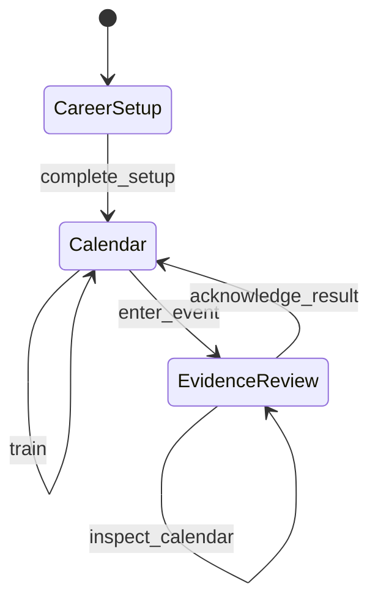

# AI Game State Machine Pattern

A tiny runnable example of how a state machine can keep an AI-assisted game
coherent while features, screens, and rules are changing quickly.

The example is a synthetic chess-career loop. It has no model dependency, no
framework, and no real game or player data. It uses only Node.js built-ins.

## The Lesson

AI is good at adding plausible features locally. A state machine gives the
whole game an enforceable answer to a harder question:

> Given everything that has already happened, what may happen next?

In this pattern, one selector owns the current obligation and legal commands.
The engine rejects illegal commands even if a screen, script, or AI-generated
caller attempts them.

That creates four useful guarantees:

- illegal actions fail without changing state;
- inspection can remain read-only;
- blocking obligations survive save and restore;
- the same seed and command log rebuild the same career.

## Run It

Requires Node.js 20 or newer. There are no packages to install.

```sh
npm run demo
npm test
npm run check
```

The demo prints a short legal path, a rejected attempt to advance past a
pending result, and a deterministic replay check.

## The Small State Machine



The important boundary is not the diagram. It is the executable relationship
between three things:

1. `selectCareerFlow(state)` derives the current obligation and legal actions.
2. `applyCareerCommand(state, command)` rejects anything outside that set.
3. Tests prove the invariants independently of any model or UI.

The active flow is deliberately not stored in the save. It is derived from the
facts that make it active, so a stale flow label cannot disagree with a pending
result.

## Why This Matters More With AI

During AI-assisted development, different sessions may work on the engine,
screens, saves, content, and tests. Each local change can look reasonable while
the overall sequence quietly becomes contradictory.

An explicit state-machine boundary gives every contributor—human or AI—the
same answer about:

- which action is legal now;
- which obligation blocks time;
- which actions may inspect without mutating;
- what must survive persistence;
- what can be replayed and checked later.

It turns an architectural intention into something executable.

## What The State Machine Does Not Solve

A correct state machine does **not** prove that the game is understandable,
interesting, emotional, balanced, or fun.

It can even create a trap: the interface starts mirroring internal obligations,
and play becomes a sequence of acknowledgement buttons. The system is orderly,
but the player is only advancing the machine.

Use the state machine to protect integrity. Use human playtests to answer the
different questions:

- Is this a meaningful decision?
- Can the player understand why it matters?
- Does the outcome change what they want to do next?
- Are they expressing a strategy or merely clearing a blocker?

Structural reliability and enjoyable play are separate achievements.

## A Practical Checklist

When adding a state machine to an AI-assisted game:

1. Name the small set of states that own real obligations.
2. Derive the current state from authoritative facts where possible.
3. Give each state an explicit set of legal commands.
4. Reject illegal commands in the engine, not only in the UI.
5. Separate inspection from mutation and time advancement.
6. Save unresolved obligations and version the state shape.
7. Make randomness deterministic from a seed and recorded commands.
8. Test known-bad transitions as well as the happy path.
9. Keep a human playtest gate that the state-machine tests cannot satisfy.

Start smaller than this example if your loop only needs two states. Add a state
only when it owns a real rule, obligation, or transition.

## Repository Map

- `src/career-machine.mjs` contains the state selector, command boundary,
  save/restore validation, and deterministic replay.
- `test/career-machine.test.mjs` proves the four core guarantees.
- `examples/demo.mjs` prints a representative journey.

## Origin And Scope

This pattern was distilled from lessons learned while building a much larger
career simulation with AI assistance. The public example was rewritten from
scratch with synthetic names and data. It is a teaching pattern, not a reusable
game framework and not evidence that any particular game is finished.

## Public Data Notice

Use synthetic fixtures. Do not add private prompts, development logs,
credentials, unpublished game content, personal data, or connector exports.

## License

MIT
