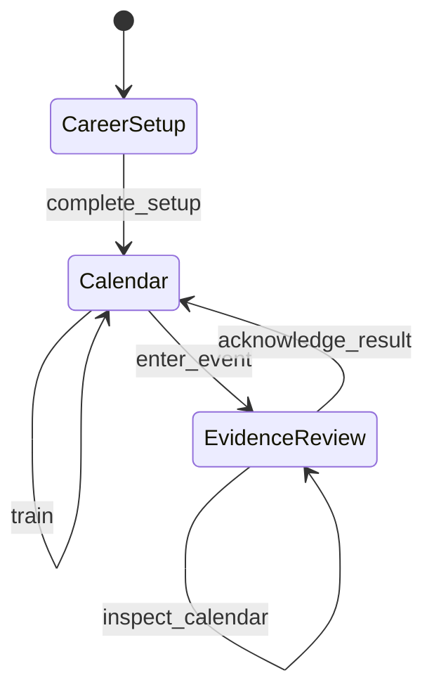

# AI Game State Machine Pattern

Try a small chess-career simulation where the engine decides which actions
are allowed next. If a result is waiting for review, a training command is
rejected without changing the game. Looking at the calendar can stay read-only.

A state machine describes those allowed steps. This example shows how to keep
the rules in one place when people or AI coding tools work on different parts
of a game. It uses synthetic names and data, Node.js built-ins, and no model,
framework or network service.

## Run It

Requires Node.js 20 or newer. There are no packages to install.

```sh
npm run demo
npm test
npm run check
```

The demo prints the steps through setup, an event result, and training. Look
for the rejected training attempt while the result is pending, then
`Replay equals live state: true`. Replay uses the same seed and command log
to rebuild the same state; it does not measure whether the game is enjoyable.

<!-- toolkit-trust-card:placement -->

<!-- toolkit-trust-card:start -->
> **Public contract:** Experimental pattern · about 10 min · Node.js 20+ · no model · no network
>
> **Operation:** Read-only check; examples may use temporary files
>
> **A pass establishes:** Illegal actions remain non-mutating, inspection is read-only, obligations persist, and seeded replay is deterministic.
>
> **It does not establish:** State-machine correctness does not prove that the game is understandable, balanced, emotional, or fun.
>
> **First check:** `npm test`
<!-- toolkit-trust-card:end -->

## The Lesson

A screen, script or AI-generated caller may request an action the game cannot
yet allow. The state machine answers:

> Given everything that has already happened, what may happen next?

In this pattern, one selector—a function that reads the state—identifies the
current obligation and legal commands. An obligation is something that must
be resolved before play can advance.
The engine rejects illegal commands even if a screen, script, or AI-generated
caller attempts them.

That creates four useful guarantees:

- illegal actions fail without changing state;
- inspection can remain read-only;
- blocking obligations survive save and restore;
- the same seed and command log rebuild the same career.

## The Small State Machine



Three parts of the code enforce the sequence shown above:

1. `selectCareerFlow(state)` derives the current obligation and legal actions.
2. `applyCareerCommand(state, command)` rejects anything outside that set.
3. Tests check that these rules hold without a model or user interface.

The save stores the facts that determine the active flow, such as a pending
result. The selector derives the flow from those facts when needed, avoiding
a separately saved label that could become stale.

## Why This Matters More With AI

During AI-assisted development, different sessions may work on the engine,
screens, saves, content, and tests. Each local change can look reasonable while
the overall sequence quietly becomes contradictory.

An explicit state-machine boundary gives every contributor—human or AI—the
same answer about:

- which action is legal now;
- which obligation blocks time;
- which actions may inspect without mutating;
- what must survive persistence;
- what can be replayed and checked later.

The engine can reject a command even when its caller gets the sequence wrong.

## What The State Machine Does Not Solve

A correct state machine does **not** prove that the game is understandable,
interesting, emotional, balanced, or fun.

It can even create a trap: the interface starts mirroring internal obligations,
and play becomes a sequence of acknowledgement buttons. The system is orderly,
but the player is only advancing the machine.

Use the state machine to keep game state consistent. Then ask people to play
and consider:

- Is this a meaningful decision?
- Can the player understand why it matters?
- Does the outcome change what they want to do next?
- Are they expressing a strategy or merely clearing a blocker?

A passing test suite leaves those playtest questions open.

## A Practical Checklist

When adding a state machine to an AI-assisted game:

1. Name the small set of states that own real obligations.
2. Derive the current state from authoritative facts where possible.
3. Give each state an explicit set of legal commands.
4. Reject illegal commands in the engine, not only in the UI.
5. Separate inspection from mutation and time advancement.
6. Save unresolved obligations and version the state shape.
7. Make randomness deterministic from a seed and recorded commands.
8. Test known-bad transitions as well as the happy path.
9. Keep a human playtest gate that the state-machine tests cannot satisfy.

Start smaller than this example if your loop only needs two states. Add a state
only when it owns a real rule, obligation, or transition.

## Repository Map

- `src/career-machine.mjs` contains the state selector, command boundary,
  save/restore validation, and deterministic replay.
- `test/career-machine.test.mjs` checks the four core guarantees.
- `examples/demo.mjs` prints a representative journey.

## Origin And Scope

This pattern was distilled from lessons learned while building a much larger
career simulation with AI assistance. The public example was rewritten from
scratch with synthetic names and data. It is a teaching pattern, not a reusable
game framework and not evidence that any particular game is finished.

## Public Data Notice

Use synthetic fixtures. Do not add private prompts, development logs,
credentials, unpublished game content, personal data, or connector exports.

## License

MIT
